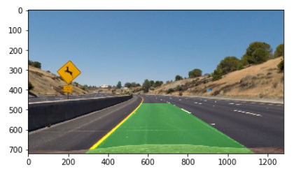
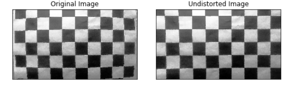
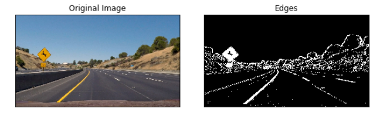
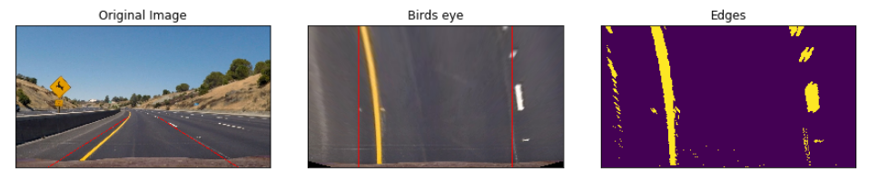
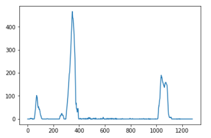
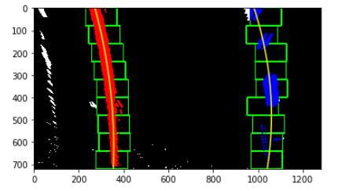
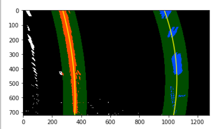

## Advanced Lane Finding Pipeline

Below we cover briefly how we addressed each of the rubric points. The Jupyter notebook provides more detailed insight into the pipeline, as well as a larger array of images illustrating our approach. It is supported by python code found in the Source folder of this repository. 

## 1. Calibrate Camera

To calibrate the camera, we are using the 20 chessboard images that we were provided by Udacity. Using the find Chessboard corners of the cv2 library, we identify a 9 by 6 chessboard in each of them, and with these points we can find the distortion transformation of the lens.
Of these 20 images, we noticed that on three of them we can not find the board. Inspecting them (images 1, 4 and 5) we notice that en each of them at least one of the chessboard corners is cropped. If we really wanted to use them, we could change the size of the chessboard to find, but instead they served as an easy way to test that the calibration was indeed working.

The image above showcases the result of undistorting the image using the calibration we found out.

## 2. Obtain edges

In this step, we want to process the images to obtain a binary where the lanes are easy to identify and there is little else to distract away from them. To do so, we wil use a few different techniques to isolate the pixels that are likely to define the lanes.

To pick up the likely lane pixels, we use a few different techniques. First we obtain different single channel versions of the image:
* Greyscale
* S channel from HLS
* L channel from HLS
We also obtain a fourth image using a hard coded thresholding on the HSV colour map that picks yellow and white.

After that, we applied first and second degree operators to the single channel images (Sobel and Laplacian), as well as thresholding to the resulting images to obtain binaries.

We experimented with different combinations of the above, and settled on a Laplacian of the S channel, the Sobel on the greyscale image, and binaries for the S channel and the HSV yellow and white. We combined all of them to obtain the set of likely pixels of the lanes.

The relevant code is in Source/img_processing.py

## 3. Perspective transformation

To obtaing the Bird's eye view of the lane, we first used the images with straigh lanes to identify a region that should be a rectangle if seen from above. Playing around with the points that define this triangle, we arrived at a transformation that seems to work well with the images provided (althoug it is fair to say, it is neither robust nor automatic, and will be very problematic whenever we have non flat terrain).

The image below illustrates the transform. The sanity check is seeing that the lane lines look equidistant after the transformation.

## 4. Fitting a (lane) curve.

After obtaining the Bird's eye view of the likely lane pixels, it is time to try and obtain a more useful representation of the lanes. In the first project of this Nano-degree, we simply fitted a straight line. This time we do something slightly more sophisticated.

We followed the suggestions of the classes, and we star by identifying the likely position of bottom of the right and left lanes using a histogram of the lower third of the bird's eye view image.

As we can see above, we are likely to identify the general location of the lane by looking at the modes of the above distribution, namely, the left hand side and right hand side modes are good starting points to look for the lanes.
U
sing this information, we do a sliding window search to find all the pixels that are likely to belong to the lane lines.
We draw a window around each of our initial points, and identify all the pixels that are within the window (which we colour red for the left lane and blue for the right).
The next window is drawn immediately above, and can slide left or righ if the number of pixels found is big enough, in which case the centre of the new window is taken to be the average x coordinate in the previous one.

Having collected all the right hand lane and left hand lane pixels, we can now fit a curve to each of this sets, where we take y to be a function of x (because the lanes are close to vertical). The picture above illustrates both the sliding windows and th fitted curves.

Once we have identified the lanes in a frame, we expect that they will be in a similar place in the next one, and thus it is unnecessary to go through the full sliding window process again. Instead, we use the lanes (fitted curves) from the previous frame, and draw a search region around them. These regions are simply definied by applying a margin to the x-coordinate of each curve. We can then again identify all the pixels that fall under these regions, and fit new lanes for them.

## 5. Curvature and position.

Now we are ready to measure the radius of curvature and the position of the camera with respect to the centre of the lane. Instead of fitting a curve to the lane pixels on the bird's eye view, we first transform them to metres. To do so we use the fact that the length of the lane we see on the bird's eye view is roughly 30 m, while the witdth of the lane should be around 3.7 m. 
Once we transform the pixels, we now fit a 2nd degree polynomial and use the formula provided in the class to obtain the curvature.
To calculate how far off the centre of the lane the camera is, we take the pixel distance from the middle of the image to each of the lanes, transform it to metres, and take half of the difference between them. If we get a positive number, the camera is right of centre, and if it is negative, we are left of centre.

In the Jupyter notebook we have an example of these quantities being calculated and (together with the lane) being overlayed on top of a test image.

## 6. Discussion.

Our pipeline worked well on the first video, but it fails on the Challenge one. We tried tweaking it to handle the added difficulty of the very dark regions in the second one, as well as the false positive of dark non-lane lines being present.

Unfortunately we didn't have enough time to apply all the insights that we obtained while attempting the challenge video, but we summarize here the main ways we can make our pipeline more robust:

### Automatic bird's eye transformation

It would 

